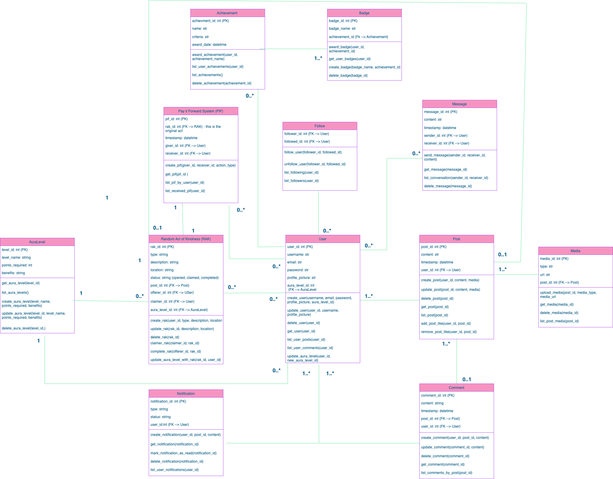
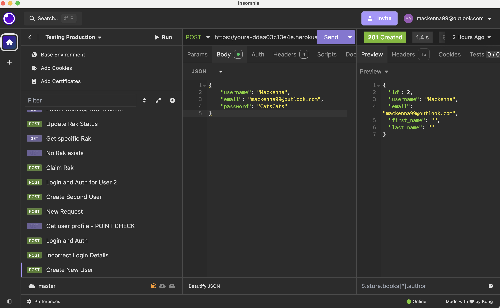
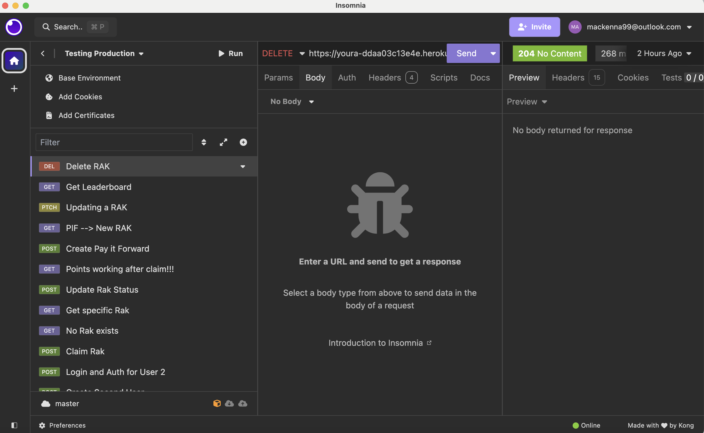
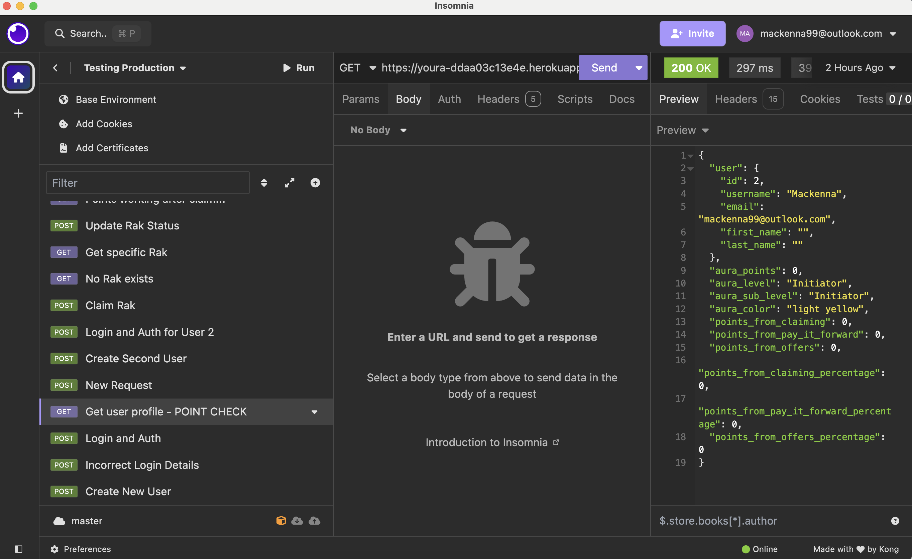
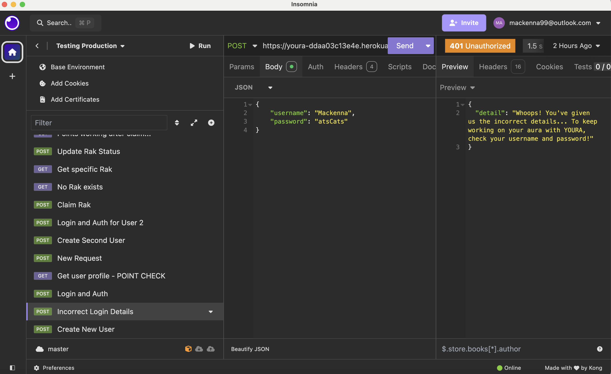
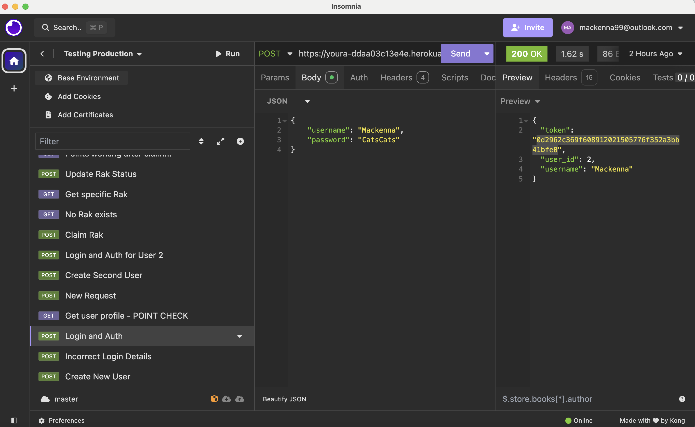
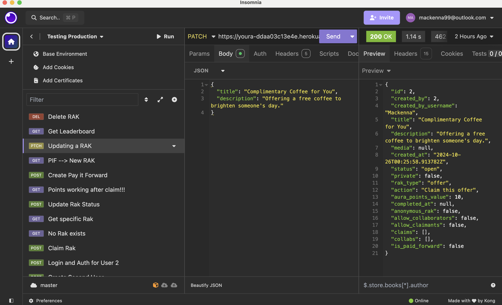

# YOURA (Your - Aura)

Mackenna Dries 

## ATTENTION:
Ok. SO i know this is a little ambitious... But i have big hopes and dreams and a lack of knowledge won't hold me back.

Some extra features are not fully functional at the moment, and i know that some of the logic is a little bit funky in certain spots... I think I will be able to clear things up when I work on the front end and can see how it's all working .... at least that is the plan 

## Planning:

### Concept/Name
**YOURA** is a platform designed to inspire and promote positivity through Random Acts of Kindness (RAKs), where users can grow their aura by recieiving aura. Users can post either requests or offers of a RAK, claim acts to fulfil, and earn aura points, which represent their contribution to the kindness community. The more RAKs a user performs, the higher their aura level grows, symbolised by visual elements such as glowing avatars and badges.

The app integrates social media features, allowing users to follow others, share posts, upload media, and comment on acts of kindness. It encourages users to pay it forward after receiving a RAK, ensuring that kindness spreads throughout the community. With a focus on positive interactions, users can take part in kindness challenges, earn achievements, and build an inspiring feed of their contributions.

The app fosters a supportive environment where users can track their impact, connect with like-minded individuals, and share their journey toward making the world a kinder place, all while maintaining privacy and control over their profiles and posts.

### Intended Audience/User Stories
- **Intended Audience**: The intended audience for YOURA includes individuals who want a social media platform that does good and promotes positivity, through random acts of kindness, and social responsibility.
- **User Stories**:
  - As a user, I want to post an offer to perform an act of kindness so that others can benefit.
  - As a user, I want to request help through a Random Act of Kindness when I need support.
  - As a user, I want to claim an existing offer so I can help someone in need.
  - As a user, I want to earn aura points and badges for completing acts of kindness to track 
  my contributions.
  - As a user, I want to follow other users who inspire me, and view their RAK contributions.
  - As a user, when I have benefited from a Random Act of Kindness I want to be able to Pay it Forward to the next person. 
  - As a user, I want to follow my friends and have a curated feed of their posts. 
  - As a user I want to acces an 'explore page' with RAK's from people I don't know. 

### Front End Pages/Functionality
- **Home Page**
  - Displays a feed of active RAK posts (offers and requests).
  - Users can filter and search for specific types of RAKs.
  - Provides an overview of the user's aura level and badges.
- **RAK Creation Page**
  - Allows users to create a new RAK (offer or request).
  - Users can upload media (photos, videos) and set the visibility of their RAK (public/private).
- **RAK Detail Page**
  - Displays details about a specific RAK post, including the owner and claimant.
  - Users can claim an offer or fulfil a request.
  - Includes comments and updates from users involved in the RAK.
- **User Profile Page**
  - Shows the user's history of RAKs (offers and requests).
  - Displays earned badges and aura levels.
  - Users can edit their profile details.
- **Feed**
  -Shows the RAK's and activity of users you are following
- **Explore Page**
  -Shows random RAKs that you might be interested in (potentially based off ones you have interacted with/similar aura level)

### To Do
  - each claim has a column that is either true or false - getting details without the username
  - ammount ? price ? 
  - when deleting - set user to inactive rather than deleting - field is active - True 
  - logic for delete (images can be deleted not users ????)
  - deploy before saturday
  - storing points as queries 
  - how points were acquired? - do i want to include this --- YES --- points associated with categories, you have earnt this doing raks, your have earnt this from paying it forward --- DONE 
  - maybe this is more for the front end but it could be like data pop ups on the profile (how points are acquired --- algorithm to calculate percantages???)
  - points should proabably be in the user table as they have a one to one relationship with the user - this will be chatoic to fix --- DONE!!!!
  - a table with aura_pointsz_type - offer, pay it forward, do users get points for requesting (maybe a very small ammount)
  - point logic - points only awarded when action is complete - ie rak or pif -- DONE 
  - leaderboard - enumerating over the list of users - example on stack overflow 
  - test leaderboard -- DONE 
  - fix comments clean up code !!!!!
  - implement my own custom error pages (link on slack)
  - show a collaboration on insomnia 
  - anonymous!!!!! MAKE SURE THIS WORKS 
  - update user detail!!!! - change username password etc 
  - ordering projects in a feed - by latest post or by other filters
  - only allowing a claim if rak is open
  - making sure personal details are anonymous
  - admin functions
  - align feature instead of like

  - add profile features ( Profile picture, bio etc )
  - develop feed and explore (wander) page
  - implemet align with this feature (like)
  - TEST POINTS AFTER ANONYMOUS CLAIM 
  - Why when retrieving is it not anonymous ?????
### Design Ideas
- **The Look and Feel**
  - ethereal look and feel - stardust, glowing auras 
  - Login/Loading page with moving stars along lines 
  - Feed Page 
  - Discover Page 
  - Profile 
  - Aura details page 
  - I think the base/background colour needs to be black or very close to for the colours to show up the best - maybe a nightime feel/stardust 

### API Spec

| URL                                | HTTP Method | Purpose                                              | Description                                                                                               | Request Body                                                                                                                                 | Success Response Code | Authentication/Authorization         |
|------------------------------------|-------------|------------------------------------------------------|-----------------------------------------------------------------------------------------------------------|----------------------------------------------------------------------------------------------------------------------------------------------|------------------------|--------------------------------------|
| `/rak/`                            | POST        | Create RAK Post                                      | Creates a new Random Act of Kindness (RAK) post (offer or request).                                       | `title`, `description`, `media`, `private`, `rak_type`, `action`, `aura_points_value`, `anonymous_rak`, `allow_collaborators`, `allow_claimants` | 201                    | Authenticated users only             |
| `/rak/<int:pk>/`                   | GET         | Retrieve RAK Post                                    | Retrieves the details of a specific RAK post.                                                             | None                                                                                                                                         | 200                    | Authenticated users only             |
| `/rak/<int:pk>/`                   | PUT         | Update RAK Post                                      | Updates a specific RAK post’s details.                                                                    | `title`, `description`, `media`, `private`, etc.                                                                                            | 200                    | Authenticated users, RAK creator     |
| `/rak/<int:pk>/`                   | DELETE      | Delete RAK Post                                      | Deletes a specific RAK post.                                                                              | None                                                                                                                                         | 204                    | Authenticated users, RAK creator     |
| `/rak/unclaimed/`                  | GET         | List Unclaimed RAKs                                  | Retrieves all unclaimed, public RAK posts.                                                                | None                                                                                                                                         | 200                    | No authentication required           |
| `/rak/claimed/`                    | GET         | List Claimed RAKs                                    | Retrieves all claimed, public RAK posts.                                                                  | None                                                                                                                                         | 200                    | No authentication required           |
| `/rak/<int:pk>/claim/`             | POST        | Claim a RAK Post                                     | Claims a RAK post, automatically updating its status to "in progress."                                    | `anonymous_claimant`, `comment`                                                                                                             | 200                    | Authenticated users only             |
| `/rak/<int:pk>/collaborate/`       | POST        | Collaborate on RAK                                   | Allows users to collaborate on a specific RAK post.                                                       | `anonymous_collaborator`, `comment`                                                                                                          | 200                    | Authenticated users only             |
| `/rak/<int:pk>/enable-collaborators/` | POST     | Enable RAK Collaboration                             | Enables multiple collaborators on a RAK post, allowing others to join.                                    | None                                                                                                                                         | 200                    | Authenticated users, RAK creator     |
| `/rak/<int:pk>/status/`            | POST        | Update RAK Status                                    | Updates the status of a RAK post to open, in progress, or completed.                                      | `status` (open, in progress, completed)                                                                                                      | 200                    | Authenticated users, RAK creator     |
| `/rak/<int:pk>/pay-it-forward/`    | POST        | Create Pay It Forward                                | Creates a Pay It Forward linked to a completed RAK, which becomes a new RAK post.                         | Fields for new RAK post                                                                                                                      | 201                    | Authenticated users only             |
| `/claims/`                         | GET         | List All Claims                                      | Retrieves a list of all RAK claims.                                                                       | None                                                                                                                                         | 200                    | Authenticated users only             |
| `/rak/<int:pk>/claimants/`         | GET         | List Claimants of RAK                                | Retrieves all claimants of a specific RAK post.                                                           | None                                                                                                                                         | 200                    | Authenticated users only             |
| `/rak/<int:pk>/collaborators/`     | GET         | List Collaborators of RAK                            | Retrieves all collaborators of a specific RAK post.                                                       | None                                                                                                                                         | 200                    | Authenticated users only             |
| `/users/<int:pk>/`                 | GET         | Retrieve User Details                                | Retrieves the details of a specific user by user ID.                                                      | None                                                                                                                                         | 200                    | Authenticated users only             |
| `/users/<int:pk>/aura-points/`     | GET         | Display User’s Aura Points                           | Displays a user's aura points and progress towards the next level.                                        | None                                                                                                                                         | 200                    | Authenticated users only             |
| `/leaderboard/`                    | GET         | Aura Points Leaderboard                              | Displays a leaderboard of top users based on aura points.                                                 | None                                                                                                                                         | 200                    | No authentication required           |
| `/users/<int:pk>/follow/`          | POST        | Follow User                                          | Allows a user to follow another user by user ID.                                                          | None                                                                                                                                         | 200                    | Authenticated users only             |
| `/users/<int:pk>/unfollow/`        | POST        | Unfollow User                                        | Allows a user to unfollow another user by user ID.                                                        | None                                                                                                                                         | 204                    | Authenticated users only             |
| `/users/<int:pk>/block/`           | POST        | Block User                                           | Allows a user to block another user by user ID.                                                           | None                                                                                                                                         | 200                    | Authenticated users only             |
| `/users/<int:pk>/report/`          | POST        | Report User                                          | Allows a user to report another user by user ID.                                                          | None                                                                                                                                         | 200                    | Authenticated users only             |
| `/feed/`                           | GET         | Curated Feed                                         | Displays a feed of RAKs from users that the current user follows.                                         | None                                                                                                                                         | 200                    | Authenticated users only             |
| `/explore/`                        | GET         | Explore Page                                         | Displays RAKs from users that the current user does not follow.                                           | None                                                                                                                                         | 200                    | Authenticated users only             |
| `/users/<int:pk>/aura-points-details/` | GET     | Display Aura Points Calculation                      | Displays details on how a user's aura points are calculated.                                              | None                                                                                                                                         | 200                    | Authenticated users only             |
| `/user/profile/`                   | GET         | Retrieve User Profile                                | Retrieves the authenticated user’s profile details.                                                       | None                                                                                                                                         | 200                    | Authenticated users only             |
| `/user/profile/`                   | PUT         | Update User Profile                                  | Updates the authenticated user’s profile details.                                                         | Profile fields                                                                                                                               | 200                    | Authenticated users only             |
| `/user/delete/`                    | DELETE      | Deactivate User Account                              | Deactivates the authenticated user’s account.                                                             | None                                                                                                                                         | 204                    | Authenticated users only             |
| `/auth/token/`                     | POST        | Obtain Auth Token                                    | Authenticates a user and returns a token with user details upon success.                                  | Username and password                                                                                                                        | 200                    | Public (for login)                   |
| `/users/`                          | GET         | List Users                                          | Retrieves a list of all users.                                                                            | None                                                                                                                                         | 200                    | Public                                |
| `/users/`                          | POST        | Create User                                          | Registers a new user.                                                                                     | User registration details                                                                                                                    | 201                    | Public                                |
| `/users/<int:pk>/profile/`         | GET         | Retrieve User Profile by ID                          | Retrieves a user’s profile details by their user ID.                                                      | None                                                                                                                                         | 200                    | Authenticated users only             |
| `/leaderboard/`                    | GET         | Leaderboard of Top Users                             | Displays a leaderboard of top users based on aura points.                                                 | None                                                                                                                                         | Public                               |
| `/users/<int:pk>/follow/`          | POST        | Follow a User by ID                                  | Follow a user by their user ID.                                                                           | None                                                                                                                                         | 201                    | Authenticated users only             |
| `/users/<int:pk>/unfollow/`        | POST        | Unfollow a User by ID                                | Unfollow a user by their user ID.                                                                         | None                                                                                                                                         | 204                    | Authenticated users only             |
| `/users/<int:pk>/block/`           | POST        | Block a User by ID                                   | Block a user by their user ID.                                                                            | None                                                                                                                                         | 200                    | Authenticated users only             |
| `/users/<int:pk>/report/`          | POST        | Report a User by ID                                  | Report a user for inappropriate behavior by their user ID.                                                | None                                                                                                                                         | 200                    | Authenticated users only             |
| `/feed/`                           | GET         | View RAK Feed                                        | Displays RAKs posted by users followed by the current user.                                               | None                                                                                                                                         | 200                    | Authenticated users only             |
| `/explore/`                        | GET         | Explore RAK Feed                                     | View RAKs from users not followed by the current user.                                                    | None                                                                                                                                         | 200                    | Authenticated users only             |
| `/users/<int:pk>/aura-points-details/` | GET     | Display Aura Points Calculation Details              | Provides a breakdown of a user's aura points based on their RAKs and other activities.                    | None                                                                                                                                         | 200                    | Authenticated users only             |
| `/user/profile/`                   | GET         | Retrieve Own Profile                                 | Retrieve the profile details of the authenticated user.                                                   | None                                                                                                                                         | 200                    | Authenticated users only             |
| `/

## Project Requirements
Your crowdfunding project must:

- [x] Be separated into two distinct projects: an API built using the Django Rest Framework and a website built using React. 
- [x] Have a cool name, bonus points if it includes a pun and/or missing vowels. See https://namelix.com/ for inspiration. (Bonus Points are meaningless)
- [x] Have a clear target audience.
- [x] Have user accounts. A user should have at least the following attributes:
  - [x] Username
  - [x] Email address
  - [x] Password
- [x] Ability to create a “project” to be crowdfunded which will include at least the following attributes:
  - [x] Title
  - [x] Owner (a user)
  - [x] Description
  - [x] Image
  - [x] Goal - either offering a random act of kindness or requesting one
  - [x] Whether it is currently open to accepting new supporters or not
  - [x] When the project was created
- [x] Ability to "claim" to a random act of kindness offer or request. A claim should include at least the following attributes:
  - [x] An amount, or action
  - [x] The rak_id the claim is for
  - [x] The supporter/user (i.e. who created the pledge)
  - [x] Whether the claim is anonymous or not - kind of????
  - [x] A comment to go along with the claim
- [x] Implement suitable update/delete functionality, e.g. should a project owner be allowed to update a project description?
- [x] Implement suitable permissions, e.g. who is allowed to delete a pledge?
- [x] Return the relevant status codes for both successful and unsuccessful requests to the API.
- [x] Handle failed requests gracefully (e.g. you should have a custom 404 page rather than the default error page).
- [x] Use Token Authentication, including an endpoint to obtain a token along with the current user's details.
- [ ] Implement responsive design.

### DB Schema

### Insomnia requests

## Must-Have Features:

### User Authentication and Profiles:
- Users can register, log in, and manage their profiles.
- Aura points system tied to user profiles.
- Badge tracking for completed Random Acts of Kindness (RAKs).

### RAK Posting System:
- Users can create RAK posts (either requests or offers).
- RAK statuses: open, claimed, completed.
- Users can attach media to RAKs.
- Claiming a RAK: Users can claim and complete RAKs.
- Raks have a title, description, media option and owner 

### Aura Points and Levels:
- Aura points awarded for completing RAKs.
- Points-based progression system to calculate aura levels.
- A users profile picture/icon glows with their speciifed aura colour according to thier level
- A users prfile displays thier badges next to their profile picturen

### Pay It Forward:
- This feature is offered to users who request a RAK (I.e As a user I have requested someone to shout me a coffe, they did anf no I want to pay this forward and buy someone else a coffee. This then becomes an offer or if there is a simialr request out there iot gets offered to that one)
- Pay It Forward mechanism where users can receive extra aura points for performing an act of kindness after receiving one.
- Only offered to the requestee once a RAK has been completed.

### Badge System:
- Badge milestones for completing RAKs, paying it forward, and aura level progression.
- Badges awarded automatically based on actions (e.g., 10 RAKs completed, first Pay It Forward).

### Notification System:
- Notifications for when a RAK is claimed, completed, or paid forward.
- Notifications for receiving badges and aura level increases.

### Basic Permissions:
- Restrict RAK edits to the owner.
- Public/private visibility options for RAKs.
- Owner cannot claim their own RAK 
- Only owner can delete pledge
- Owner and Claimant can update the status - or should this be an event listener? 

### RAK Status Transitions:
- Proper flow of statuses from open to claimed, then to completed.

### Actions on Posts:
- All users are able to comment on RAK Posts. 
- All users are able to like posts.

### Post Anonymity:
- Users can post RAKs anonymously.

---

## Nice-to-Have Features:

### Social Features:
- Ability to follow other users and see their RAKs in a feed.
- Like and comment functionality on RAK posts.
- Ability to unfollow other users 

### Resolution Centre:
- Uswers can report RAK's that were claimed and then unfulfilled 
- Users can report inappropriate Raks/comments
- Users can block other users
- Users can report other users 

### Leaderboard:
- Global or local leaderboard showing top contributors based on aura points or completed RAKs.

### Collaboration Acts:
- Support for group RAKs where multiple users can collaborate on larger acts of kindness.

### Challenges and Achievements:
- Weekly or monthly challenges to encourage user engagement.
- Special badges for completing challenges.

### Map Feature:
- A map showing where RAKs have been performed (global or local acts of kindness).

### Enhanced Notification System:
- Push notifications for mobile devices.
- In-app notifications with different notification types (e.g., reminders, challenge alerts).

### Advanced Analytics for Admins:
- Admin dashboard showing trends in kindness (e.g., types of acts, most active regions, etc.).

### Aura Levels

1. **Generator (The Masterful Creator)**: Warm Yellow or Golden Aura, signifying the power to start and sustain acts of kindness.
   - **Initiator**: Light Yellow - Focus on starting projects.
   - **Sustainer**: Golden Yellow - Maintaining momentum.
   - **Visionary**: Amber - Long-term impact.
   - **Creator**: Deep Orange - Manifesting through hard work.
2. **Manifesting Generator (The Impacting Creator)**: Fiery Red Aura, representing quick action and impactful results.
   - **Accelerator**: Bright Red - Quick decision-making and action.
   - **Multitasker**: Coral Red - Efficient and dynamic.
   - **Problem Solver**: Burgundy - Strategically finding solutions.
   - **Transformer**: Crimson - Creating impactful changes.
3. **Projector (The Wisdom Keeper)**: Deep Blue Aura, symbolising wisdom and guidance.
   - **Guide**: Sky Blue - Supporting others with clarity.
   - **Teacher**: Navy Blue - Sharing wisdom.
   - **Healer**: Indigo - Restoring balance.
   - **Orchestrator**: Royal Blue - Directing complex situations.
4. **Manifestor (The Force of Nature)**: Dark Green Aura, representing the power to initiate change.
   - **Instigator**: Olive Green - Initiating change.
   - **Leader**: Emerald Green - Powerful presence.
   - **Independent**: Dark Teal - Working solo, pushing boundaries.
   - **Creator**: Deep Forest Green - Transforming ideas into action.
5. **Reflector (The Sacred Mirror)**: Silver or White Aura, reflecting the community's energy.
   - **Observer**: Light Silver - Reflecting the environment.
   - **Analyzer**: Soft Grey - Processing feedback.
   - **Balancer**: Pearl White - Achieving harmony.
   - **Harmoniser**: Crystal White - Bringing balance.

